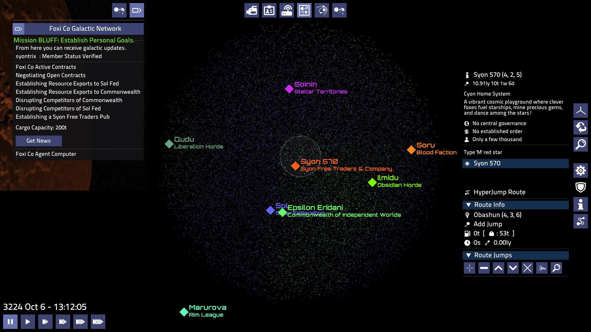
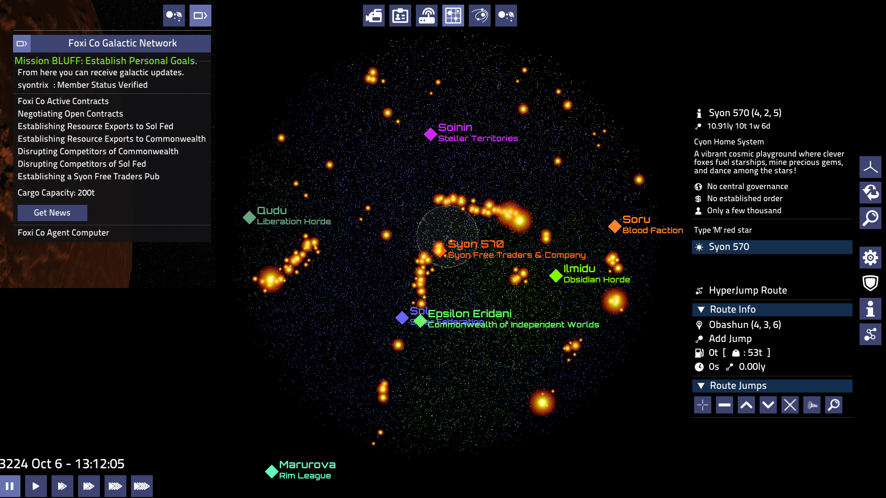

# Syon Mod

Adds a new faction `Syon Free Traders @ Company`

A company FOXI Co has aligned with a growing group of merchant vessels and has developed the new syontrix vessel and a modified mining laser.
both have their weaknesses in slow turning speed and fire rate but they make up for that in versatility and deniability.

I swear it's just a normal mining vessel sir.



Above you can see the Syon Home world first established as a manufacturing and mining operation as FOXI Co negotiated 
contracts with both SolFed and Commonwealth factions the operation size has grown exponentially. Both sides contract 
Syon Free Traders to do clandestine mission with plausible deniability. That said it is also imperative to growth that 
Syon Free Traders fly under the radar and maintain either disposition with the faction or perform opts in a clandestine manner avoiding detection.

For if the faction is to expand it must balance the line between both sides and provide more perceived aid then harm.


```

syontrix - medium_freaighter with exeptional versitility
syontrix_gvnr_none - same ship with contraversiol combat modification. And the govener riped out.

syoncannon_5mw - a modified 5mw minil laser with 2 capasitors for double fire rate and who need contaiment when we want to hit things!
                    A lighter and more capable cannon for ... efficency and profit right?!
                    
Syon 570 - The home world of Syon Free Traders. A pub at every station. Watch out for the gravity as you stand up!


FOXI Co Agent - an galactic brodcast providing news and other information to everyone.  But Foxi Co ships receave extra data and 
                alows employees to perfrom cordanated mission...

    TODO this is all a wip but i like the idea.                

```



Note Some text has been added to the english data files translation will be needed.


## Clandestine Contract.
```angular2html
local SF = "Solar Federation"
local CW = "Commonwealth of Independent Worlds"
local SY = "Syon Free Traders & Company"


For each ship killed in enemy territory the faction will pay 1000cr

If you are detected by the law then we cannot be associated with you have a nice life

To receive your payment visit world controlled by contracting faction.

You may return to Syon 570 for a new identity.

CW -> SF
SF -> CW

```
